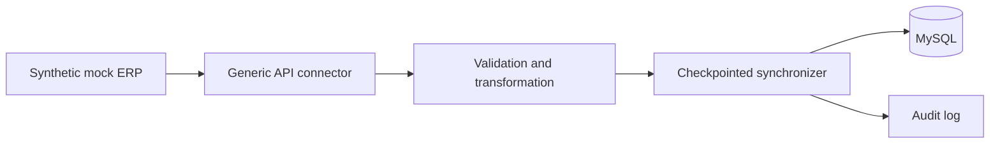

# Rahkaran ERP → MySQL Integration

[](https://github.com/ahmadrastibarzoki/rahkaran-erp-mysql-integration/actions/workflows/ci.yml)

Clean-room reference implementation of an API-based data integration pipeline for Rahkaran ERP and MySQL.

> **Clean-room disclosure:** This portfolio project is an independently reconstructed demonstration. It contains no employer data, credentials, production endpoints, proprietary business logic, confidential implementation details, or source code from the original production system.

Rahkaran ERP is referenced only to describe the integration context. This repository is not an official Rahkaran product or implementation.

## Overview

The project demonstrates a local, fully synthetic ERP integration: a mock REST service supplies invented order, customer, and product records; the connector validates and transforms them; a checkpointed loader persists them to MySQL with audit records.

## Architecture



## Features

- Configurable REST client with basic-auth abstraction, timeouts, retries, and exponential backoff.
- Deterministic pagination and synthetic records.
- Response validation, normalization, idempotent upserts, checkpoints, audit logging, and failure recovery.
- Local Docker Compose demo and dependency-free unit tests.

## Project Structure

```text
src/rahkaran_integration/  connector, validation, storage, and sync workflow
mock_server/               local synthetic REST API
configs/                   non-secret configuration defaults
docs/                      generic MySQL schema
tests/                     unit and workflow tests
```

## Synthetic Data

The mock service generates deterministic identifiers and values. Its routes (`/api/v1/orders`, `/api/v1/customers`, and `/api/v1/products`) are portfolio-only examples and are not derived from an external API.

## Configuration

Copy `.env.example` to `.env` and use only local demo values. Never commit `.env`.

## Local Demo

```bash
docker compose up --build
```

The integration container waits for the local database, loads the generic schema, and writes synthetic data. To run tests without Docker:

```bash
python -m unittest discover -s tests -v
```

## Incremental Sync

Each entity has a deterministic checkpoint. The first run loads every available page; subsequent runs request only records newer than the stored checkpoint. Checkpoints advance only after a page is successfully persisted, so an interrupted run can be safely repeated.

## Reliability

Retries use exponential backoff for transient transport failures. Validation errors are structured and page writes run in database transactions. Upserts and unique keys make reruns idempotent.

## Security

Secrets are read solely from environment variables. The checked-in example values are deliberately fake local-demo placeholders.

## Testing

The unit suite covers pagination, retry behavior, validation, transformations, checkpoints, duplicate handling, idempotent reruns, interrupted recovery, mock responses, and persistence behavior through an in-memory test store.

## CI

GitHub Actions runs two independent jobs from a clean checkout:

- **Unit tests** run the local Python test suite.
- **MySQL integration** starts a real MySQL 8.4 service container and this repository's existing synthetic mock ERP API. It initializes the generic schema, runs the integration application, and asserts the initial synthetic row counts, persisted checkpoints, and successful audit records.

The integration job then runs the same workflow a second time to verify idempotent upserts and unchanged business-record counts. A third fresh application process verifies that persisted checkpoints can be reused safely and that the expected audit entries are recorded. The workflow uses local runner networking and synthetic demo configuration only; it does not contact enterprise systems or require GitHub Secrets.

## Limitations

This is a teaching and portfolio project. It is not a production connector, does not implement official vendor interfaces, and does not claim production performance or business outcomes.


